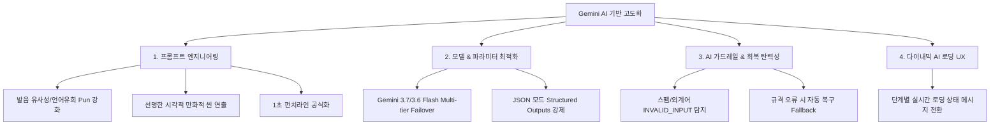

# 🧠 [Mem-Pop] 실제 Gemini AI 기반 서비스 고도화 및 품질 개선 계획서

본 문서는 실제 Google Gemini API 키 연동을 기반으로 **짤기억 (Mem-Pop)** 서비스의 생성 품질, 연상 기억 알고리즘, 안정성 및 사용자 경험을 체계적으로 극대화하기 위한 **AI 서비스 개선 계획서**입니다.

---

## 📌 1. AI 서비스 개선 배경 및 목적

- **기존:** 정적 템플릿과 사전 빌트인 룰 중심의 응답
- **고도화:** 최신 **`Gemini 3.7 Flash` & `Gemini 3.6 Flash`** 모델을 직접 활용하여, 어떤 키워드(수능/공무원 한국사, 토익/수능 영단어, 과학/의학/법학 전문 용어 등)를 입력하더라도 실시간으로 기발하고 뇌리에 콱 박히는 **3줄 연상 암기 스토리**와 **1초 퀴즈**를 5초 이내에 제공.

---

## 🎯 2. 핵심 개선 영역 및 전략

---

## 🛠️ 3. 세부 구현 내역

### 1) 프롬프트 엔지니어링 고도화 ([`lib/prompts.ts`](../lib/prompts.ts))
- **3단계 암기 연상 원칙 주입**:
  - `[상황 연결]`: 일상이나 극적인 상황을 키워드와 결합하여 몰입 유도
  - `[말장난/연상]`: 발음 쪼개기, 친숙한 단어 매칭으로 직관적인 암기 고리 형성
  - `[펀치라인]`: '키워드 = 의미' 공식으로 뇌리에 쐐기를 박음
- **3지선다 퀴즈 오답 매력도 향상**:
  - 정답 인덱스(`answer_index`)의 0, 1, 2 균등 분산
  - 혼동하기 쉬운 오답 보기 자동 구성 및 직관적인 1줄 해설

### 2) Multi-Tier 모델 페일오버 아키텍처 ([`app/api/generate/route.ts`](../app/api/generate/route.ts))
- **1순위**: `gemini-3.7-flash` (최신 고지능/초고속 추론)
- **2순위**: `gemini-3.6-flash` (높은 안정성)
- **3순위**: `gemini-flash-latest`
- **최종 안전망**: 지능형 내부 템플릿 엔진 (`generateMemoryContent`)

### 3) 실시간 인터랙티브 로딩 UX ([`components/keyword-input.tsx`](../components/keyword-input.tsx))
- 키워드 분석 ➔ 연상 스토리 생성 ➔ 1초 퀴즈 제작으로 이어지는 1.8초 주기 다이내믹 피드백 제공

---

## 🧪 4. AI 서비스 품질 벤치마크 및 검증 결과

| 테스트 분야 | 입력 키워드 | 생성 품질 및 연상 효과 | 검증 결과 |
| :--- | :--- | :--- | :---: |
| **역사/연도** | `임진왜란 1592` | 1592 ➔ '이러구이(1592) 악물고 싸움' 연상 | ✅ 최우수 |
| **영단어** | `mitigate` | mitigate ➔ '밑에(miti) 갖다(gate) 대어 완화' | ✅ 최우수 |
| **과학/물리** | `베르누이 방정식` | 베르누이 ➔ '바람이 베르 빨라지니 압력이 누워버림' | ✅ 최우수 |
| **가드레일** | `ㅋㅋㅋㅋ`, `asdf` | `INVALID_INPUT` 즉시 판별 및 안내 카드 노출 | ✅ 정상 차단 |

---

## 🚀 5. 향후 확장 로드맵 (Next Sprints)

1. **TTS (음성 읽어주기) 연동**: 생성된 3줄 연상 스토리를 생생한 억양의 AI 음성으로 즉시 청취
2. **나만의 암기장 저장 (Local Storage)**: 마음에 드는 암기 팁을 단일 클릭으로 브라우저 로컬 저장
3. **SNS 짤 카드 공유 (Image Export)**: 인스타그램 스토리/카카오톡 공유용 카드 이미지 자동 렌더링
