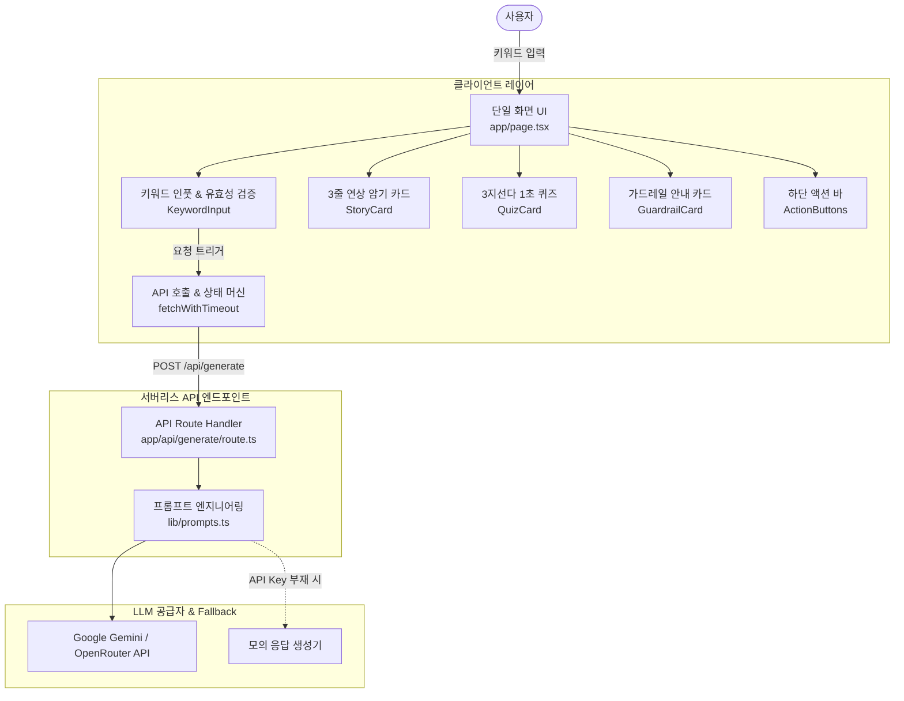
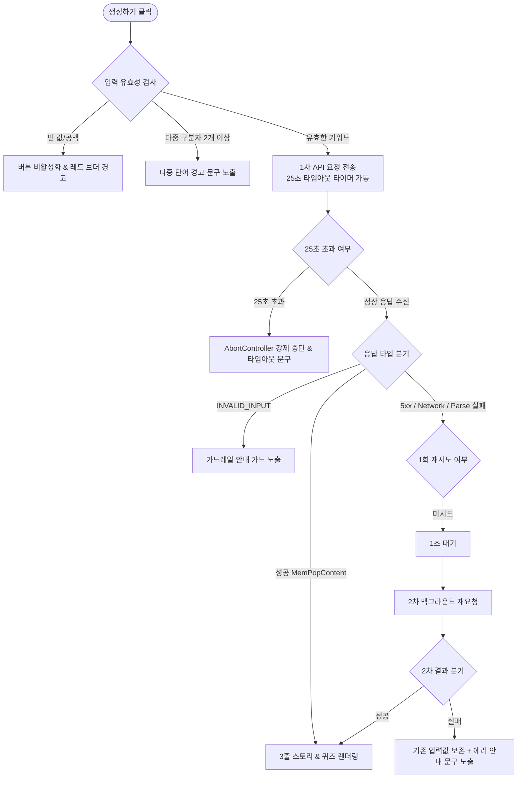

# 🧠 시스템 아키텍처 및 기술 명세서 (Mem-Pop / 짤기억)

본 문서는 **짤기억 (Mem-Pop)** 서비스의 데이터 흐름, 컴포넌트 아키텍처, 예외 처리 및 회복 탄력성 메커니즘을 상세히 설명하는 기술 문서입니다.

---

## 🏗️ 1. 전체 시스템 아키텍처



---

## 🔄 2. 예외 처리 및 회복 탄력성 흐름도



---

## 🧩 3. 컴포넌트 계층 및 역할

| 컴포넌트 | 경로 | 역할 및 주요 기능 |
| :--- | :--- | :--- |
| **`Page`** | [`app/page.tsx`](file:///c:/mem-pop/app/page.tsx) | 전체 애플리케이션의 최상위 컨트롤러 및 상태 머신 관리 (`keyword`, `content`, `status`, `error`) |
| **`KeywordInput`** | [`components/keyword-input.tsx`](file:///c:/mem-pop/components/keyword-input.tsx) | 단일 키워드 입력, 글자 수(30자) 카운터/차단, 추천 칩, 다중 구분자 경고 |
| **`StoryCard`** | [`components/story-card.tsx`](file:///c:/mem-pop/components/story-card.tsx) | 3단계([상황 연결], [말장난/연상], [펀치라인]) 연상 팁 렌더링 및 클립보드 원클릭 복사 |
| **`QuizCard`** | [`components/quiz-card.tsx`](file:///c:/mem-pop/components/quiz-card.tsx) | 3지선다 보기, 즉각적인 색상 피드백(초록/빨강), 정답 해설 및 중복 클릭 방지 |
| **`GuardrailCard`** | [`components/guardrail-card.tsx`](file:///c:/mem-pop/components/guardrail-card.tsx) | `INVALID_INPUT` 수신 시 올바른 단어 입력을 유도하는 경량 피드백 카드 |
| **`ActionButtons`** | [`components/action-buttons.tsx`](file:///c:/mem-pop/components/action-buttons.tsx) | '다시 생성하기' 및 '새로운 단어 입력하기' 액션 핸들러 |

---

## 📡 4. API 스키마 및 응답 구조

### 요청 규격 (`POST /api/generate`)
```json
{
  "keyword": "임진왜란 1592"
}
```

### 성공 응답 (`200 OK`)
```json
{
  "success": true,
  "data": {
    "story": [
      "1592년, 왜군이 부산포로 쳐들어오며 임진왜란이 발발했습니다.",
      "왜군이 쳐들어오자 백성들이 '이러구(159) 이(2) 악물고 싸워야 해!'라고 외쳤습니다.",
      "임진왜란은 '이러구이(1592)' 악물고 싸운 해입니다!"
    ],
    "quiz": {
      "question": "임진왜란이 일어난 연도는 언제일까요?",
      "options": [
        "1492년",
        "1592년",
        "1692년"
      ],
      "answer_index": 1,
      "explanation": "임진왜란은 1592년('이러구이' 악물고 싸운 해)에 일어났습니다."
    }
  }
}
```

### 가드레일/예외 응답
```json
{
  "success": false,
  "error": "INVALID_INPUT"
}
```
*(기타 에러 코드: `PARSE_ERROR`, `TIMEOUT`, `NETWORK_ERROR`)*
