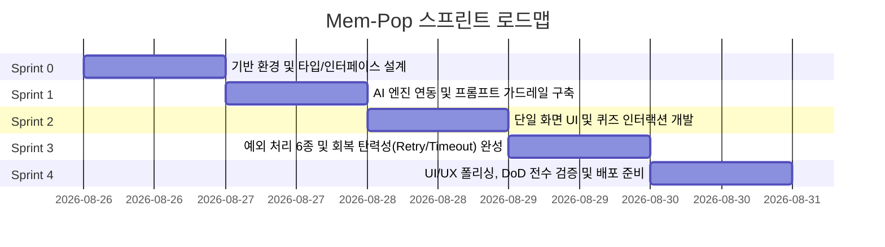

# 🚀 [Mem-Pop / 짤기억] 스프린트 기반 개발 계획서

본 문서는 루트에 작성된 [`PRD.md`](../PRD.md)의 모든 기능 및 비기능 요구사항을 충실히 반영하여, 체계적이고 단계적으로 개발을 수행할 수 있도록 구성된 **스프린트 단위 개발 계획서**입니다.

---

## 📌 1. 프로젝트 개요 및 핵심 목표

| 항목 | 내용 |
| :--- | :--- |
| **서비스명** | **짤기억 (Mem-Pop)** - 뇌리에 콱 박히는 AI 암기 튜터 |
| **핵심 가치** | 단 한 줄의 키워드 입력으로 **3줄 연상 스토리**와 **3지선다 1초 퀴즈**를 5초 내 즉시 생성 및 인터랙션 |
| **아키텍처 원칙**| 로그인/결제/별도 DB 연동 없는 **초경량 단일 화면(Single Page) 클라이언트 중심 웹 애플리케이션** |
| **기술 스택** | Next.js (App Router), React 19, TypeScript, Tailwind CSS, Framer Motion, Lucide React |

---

## 🗓️ 2. 스프린트 로드맵 요약



---

## 🏃 3. 스프린트별 상세 개발 계획

---

### 🔹 Sprint 0: 기반 환경 및 타입/인터페이스 설계
> **목표:** 프로젝트 아키텍처 정비, 데이터 모델링, 공통 유틸리티 기반을 구축한다.

- [x] **Task 0.1: 데이터 타입 및 스키마 정의 (`types/mem-pop.ts`)**
  - PRD 4.2 요구사항에 맞춘 AI 응답 규격 정의:
    ```typescript
    export interface QuizData {
      question: string;
      options: [string, string, string]; // 3지선다 고정
      answer_index: 0 | 1 | 2;
      explanation: string;
    }

    export interface MemPopContent {
      story: [string, string, string]; // 3줄 연상 스토리
      quiz: QuizData;
    }

    export type AIResponse = 
      | { success: true; data: MemPopContent }
      | { success: false; error: 'INVALID_INPUT' | 'PARSE_ERROR' | 'TIMEOUT' | 'NETWORK_ERROR' };
    ```
- [x] **Task 0.2: 환경 설정 및 API 클라이언트 뼈대 구성**
  - Next.js API Route / Client API 호출 레이어 분리 구조 설계
  - 타임아웃 처리를 위한 `AbortController` 유틸리티 함수 작성 (`lib/fetch-with-timeout.ts`)
- [x] **Task 0.3: 디자인 토큰 및 UI 스타일 가이드 정립**
  - 브랜드 테마 컬러 (암기 몰입감을 주는 HSL 팔레트) 및 타이포그래피 설정

---

### 🔹 Sprint 1: AI 엔진 연동 및 프롬프트 가드레일 구축
> **목표:** LLM API 프롬프트 엔지니어링, 엄격한 JSON 구조화 출력 및 가드레일(`INVALID_INPUT`) 응답을 구현한다.

- [x] **Task 1.1: 시스템 프롬프트 엔지니어링 (`lib/prompts.ts`)**
  - **3줄 연상 암기 스토리 생성 규칙**: [상황 연결] -> [말장난/발음 연상/강렬한 시각화] -> [펀치라인] 구조 명시
  - **1초 퀴즈 생성 규칙**: 직관적인 3지선다 보기와 명확한 정답 인덱스(`0`, `1`, `2`), 한 줄 명쾌한 해설
  - **AI 가드레일 주입 (PRD 5.5)**: 무의미한 자음/모음(ㅋㅋㅋㅋ), 외계어, 허구 단어 입력 시 할루시네이션을 방지하고 `{"error": "INVALID_INPUT"}` 반환하도록 지시
- [x] **Task 1.2: AI 요청 핸들러 및 JSON 스키마 검증기 (`app/api/generate/route.ts` 또는 클라이언트 API)**
  - API 응답의 JSON 파싱 검증 및 타입 가드 적용
  - JSON 규격 오류 시 파싱 에러 트래핑 및 `PARSE_ERROR` 코드 반환

---

### 🔹 Sprint 2: 단일 화면 UI 및 퀴즈 인터랙션 개발
> **목표:** PRD의 단일 화면 레이아웃과 즉각적인 피드백을 제공하는 퀴즈 인터랙션을 완성한다.

- [x] **Task 2.1: 헤더 및 단일 인풋 컴포넌트 (`components/keyword-input.tsx`)**
  - 단일 텍스트 입력창 (Placeholder: `"외우고 싶은 단어, 개념, 연도를 1개만 입력하세요. 예: 임진왜란 1592, mitigate"`)
  - 실시간 글자 수 카운터 (`0/30`) 및 `maxlength="30"` 브라우저 차단
  - 입력 지우기(Clear) 버튼 및 키워드 추천 칩(Suggestion Chips) 배치
- [x] **Task 2.2: 3줄 연상 스토리 카드 렌더링 (`components/story-card.tsx`)**
  - 단계별 뱃지([상황 연결], [말장난/연상], [펀치라인])와 함께 3줄 스토리 노출
  - 원클릭 텍스트 복사(Clipboard) 및 시각적 복사 완료 토스트/아이콘 피드백
- [x] **Task 2.3: 3지선다 1초 퀴즈 인터랙션 (`components/quiz-card.tsx`)**
  - 정답 클릭 시: **초록색 하이라이트 + "🎉 정답입니다!" + 해설** 노출
  - 오답 클릭 시: **선택 보기 빨간색 + 정답 보기 초록색 + "💡 아쉬워요!" + 해설** 노출
  - 1회 클릭 즉시 보기 전체 비활성화(추가 클릭 방지)
- [x] **Task 2.4: 하단 액션 바 (`components/action-buttons.tsx`)**
  - **'다시 생성하기'**: 현재 입력값을 유지한 채 즉시 AI 재요청 수행
  - **'새로운 단어 입력하기'**: 입력 필드 초기화 및 상단 포커스 이동

---

### 🔹 Sprint 3: 예외 처리 6종 및 회복 탄력성(Retry/Timeout) 완성
> **목표:** PRD Section 5에 명시된 6가지 예외 상황에 대한 완전한 대응 및 자동 복구 로직을 구현한다.

- [x] **Task 3.1: 빈 값/공백 입력 예외 처리 (PRD 5.1)**
  - 빈 값 시 '생성하기' 버튼 비활성화(`disabled`)
  - 빈 값 상태에서 blur/클릭 시도 시 입력창 레드 보더 + 하단 경고 문구: *"외우고 싶은 단어나 개념을 입력해 주세요."*
- [x] **Task 3.2: 다중 키워드 및 글자 수 초과 입력 예외 처리 (PRD 5.2)**
  - 쉼표(`,`), 슬래시(`/`), 앤드(`&`) 등 다중 키워드 구분자 2개 이상 포함 시 경고 문구 실시간 노출:
    *"한 번에 한 가지 개념만 입력할 때 암기 효과가 가장 높습니다. 단어 하나만 입력해 주세요."*
  - 30자 초과 입력 차단
- [x] **Task 3.3: 네트워크/서버 오류 자동 1회 재시도 (PRD 5.3)**
  - 5xx 에러 또는 네트워크 오류 발생 시 **1초 대기 후 백그라운드 자동 1회 재요청(Auto Retry)**
  - 2회 연속 실패 시: 입력값 보존 + 안내 문구 노출: *"일시적인 오류로 인해 암기법 생성에 실패했습니다. 잠시 후 다시 시도해 주세요."* + 수동 재시도 버튼 활성화
- [x] **Task 3.4: 10초 타임아웃 및 스피너 로딩 처리 (PRD 5.4)**
  - 요청 즉시 버튼 비활성화 + 스피너 + *"뇌리에 박히는 암기 팁을 짜내는 중..."* 문구
  - **10초 타임아웃** 초과 시 요청 강제 중단(`AbortController`)
  - 입력값 유지 + 경고 문구 노출: *"요청 시간이 초과되었습니다. 다시 시도해 주세요."*
- [x] **Task 3.5: 무의미한 단어/외계어 가드레일 UI 처리 (PRD 5.5)**
  - `INVALID_INPUT` 응답 수신 시 결과 카드 대신 안내 카드 노출:
    *"올바른 단어 또는 개념을 입력해 주세요. (예: 역사적 사건, 영단어, 전문 용어)"*
  - 입력창 포커스 자동 유지
- [x] **Task 3.6: AI JSON 파싱 오류 자동 복구 (PRD 5.6)**
  - 규격 불일치 시 자동 1회 재요청 -> 최종 실패 시 입력값 보존 및 안내 문구 노출:
    *"결과를 생성하는 중 형식이 맞지 않아 실패했습니다. 다시 생성하기를 눌러주세요."*

---

### 🔹 Sprint 4: UI/UX 폴리싱, DoD 전수 검증 및 배포 준비
> **목표:** 시각적 완성도 극대화, 반응형 디자인 최적화, PRD 완료 조건(DoD) 전수 검증을 완료한다.

- [x] **Task 4.1: 인터랙션 애니메이션 & 반응형 레이아웃 고도화**
  - Framer Motion을 활용한 결과 카드 등장 및 퀴즈 피드백 모션 강화
  - 모바일, 태블릿, 데스크톱 전 디바이스 뷰포트 최적화
- [x] **Task 4.2: 접근성(A11y) & SEO 메타데이터 적용**
  - 키보드 내비게이션(Enter로 생성, Tab으로 보기 선택) 지원
  - 시맨틱 HTML5 태그(`main`, `header`, `section`, `article`) 및 ARIA 속성 점검
- [x] **Task 4.3: DoD(Definition of Done) 체크리스트 전수 검증**

---

## 🎯 4. 완료 조건 (Definition of Done) 검증 매트릭스

| 검증 항목 | PRD 요구사항 매핑 | 검증 기준 | 상태 |
| :--- | :--- | :--- | :---: |
| **원페이지 UI 구성** | PRD 3, 6.1 | 타이틀, 인풋, 버튼, 결과 카드(스토리+퀴즈+다시생성)가 단일 화면에 유기적으로 배치됨 | ✅ 완료 |
| **3줄 연상 암기 생성** | PRD 4.2, 6.2 | 키워드 입력 후 5초 이내에 3단계 연상 팁 정상 렌더링 | ✅ 완료 |
| **3지선다 1초 퀴즈** | PRD 4.3, 6.2 | 정답/오답 즉각 피드백, 보기 비활성화 및 해설 노출 | ✅ 완료 |
| **빈 값 유효성 검증** | PRD 5.1, 6.3 | 버튼 비활성화, 레드 보더 및 안내 문구 작동 | ✅ 완료 |
| **30자 제한 & 다중단어 경고**| PRD 5.2, 6.3 | 30자 초과 타이핑 차단, 2개 이상 구분자 입력 시 경고 표시 | ✅ 완료 |
| **네트워크 오류 1회 Auto Retry**| PRD 5.3, 6.3 | 1초 후 자동 1회 재시도, 최종 실패 시 텍스트 유지 & 에러 문구 | ✅ 완료 |
| **10초 타임아웃 강제 중단** | PRD 5.4, 6.3 | 10초 초과 시 Abort, 로딩 해제, 텍스트 보존 & 타임아웃 문구 | ✅ 완료 |
| **AI 가드레일 안내** | PRD 5.5, 6.3 | `INVALID_INPUT` 수신 시 가드레일 안내 카드 노출 & 포커스 유지 | ✅ 완료 |
| **JSON 파싱 오류 복구** | PRD 5.6, 6.3 | 파싱 에러 시 자동 1회 재요청 및 사용자 안내 | ✅ 완료 |
| **초경량 클라이언트 동작** | PRD 1.2, 6.4 | 로그인/결제/외부 DB 없이 프론트엔드 단독 환경 완벽 동작 | ✅ 완료 |

---

## 🛡️ 5. 리스크 관리 및 대응 방안

1. **LLM 응답 지연 (5초 목표 초과 리스크)**
   - *대응:* 경량 고속 모델(Gemini Flash 등) 사용, 프롬프트 토큰 최소화, 10초 타임아웃 Abort 로직을 통한 안전장치 확보.
2. **비정형 JSON 출력 리스크**
   - *대응:* Structured Outputs (JSON Schema) 강제 및 클라이언트 안전 파서(Zod 또는 타입 가드) + 1회 Auto-retry 적용.
3. **사용자 입력 유실 리스크**
   - *대응:* 모든 에러 및 재시도 상태에서 React State로 `keyword`를 항상 보존하여 UX 만족도 유지.

---

> 💡 **향후 개발 진행 가이드:**
> 본 문서는 `docs/` 폴더 내에 유지되며, 각 스프린트 태스크 완료 시 체크박스(`[x]`)를 갱신하여 진척도를 관리합니다.
