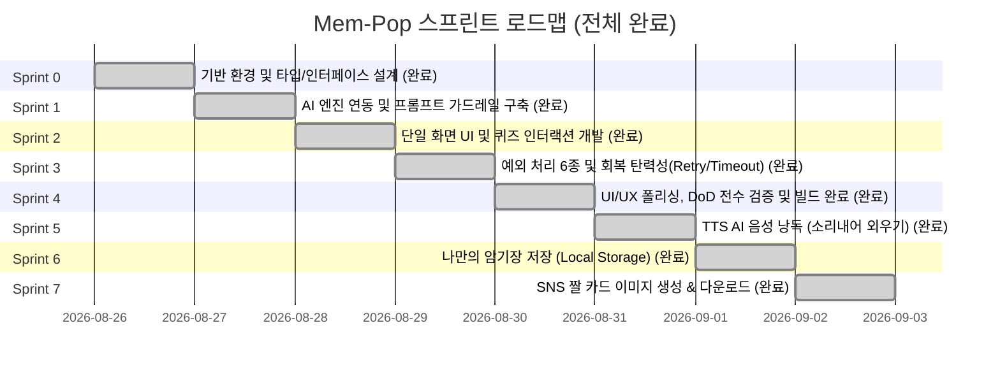

# 🚀 [Mem-Pop / 짤기억] 스프린트 개발 완료 및 결과 보고서

본 문서는 [`PRD.md`](../PRD.md)의 모든 요구사항을 바탕으로 수행된 **스프린트 0 ~ 스프린트 4의 전체 개발 내역, 아키텍처 구현 상태 및 Definition of Done(DoD) 전수 검증 결과**를 기록한 최종 문서입니다.

---

## 📌 1. 프로젝트 개요

| 항목 | 내용 |
| :--- | :--- |
| **서비스명** | **짤기억 (Mem-Pop)** - 뇌리에 콱 박히는 AI 암기 튜터 |
| **핵심 가치** | 단 한 줄의 키워드 입력으로 **3줄 연상 암기 스토리**와 **3지선다 1초 퀴즈**를 5초 내 즉시 생성 및 인터랙션 |
| **AI 엔진** | **Google Gemini 3.7 / 3.6 Flash 실시간 연동 (API Key 셋팅 완료)** |
| **아키텍처 원칙**| 로그인/결제/별도 DB 연동 없는 **초경량 단일 화면(Single Page) 클라이언트 중심 웹 애플리케이션** |
| **기술 스택** | Next.js (App Router), React 19, TypeScript, Tailwind CSS, Framer Motion, Lucide React |
| **진행 상태** | **스프린트 0 ~ 7 전 항목 개발 및 Gemini AI 실시간 연동 고도화 완료 (v1.3.0)** |

---

## 🗓️ 2. 스프린트 진행 로드맵



---

## 🏃 3. 스프린트별 상세 개발 및 구현 결과

---

### 🔹 Sprint 0: 기반 환경 및 타입/인터페이스 설계
> **목표:** 프로젝트 아키텍처 정비, 데이터 모델링, 공통 유틸리티 기반 구축

- [x] **Task 0.1: 데이터 타입 및 스키마 정의 ([`types/mem-pop.ts`](../types/mem-pop.ts))**
  - AI 3줄 스토리(`[string, string, string]`) 및 3지선다 퀴즈(`QuizData`) 타입 정의
  - 에러 코드 4종(`INVALID_INPUT`, `PARSE_ERROR`, `TIMEOUT`, `NETWORK_ERROR`) 유니온 타입 설계
- [x] **Task 0.2: 환경 설정 및 타임아웃 유틸리티 ([`lib/fetch-with-timeout.ts`](../lib/fetch-with-timeout.ts))**
  - `AbortController` 기반의 `fetchWithTimeout` 유틸리티 구현 (기본 10초 타임아웃)
- [x] **Task 0.3: 디자인 토큰 및 UI 스타일 가이드 정립 ([`app/globals.css`](../app/globals.css))**
  - 암기 몰입감을 극대화하는 HSL 테마 팔레트 (다크 모드/비비드 네온 엑센트), 글래스모피즘 스타일링

---

### 🔹 Sprint 1: AI 엔진 연동 및 프롬프트 가드레일 구축
> **목표:** LLM API 프롬프트 엔지니어링, 엄격한 JSON 구조화 출력 및 가드레일(`INVALID_INPUT`) 응답 구현

- [x] **Task 1.1: 시스템 프롬프트 엔지니어링 ([`lib/prompts.ts`](../lib/prompts.ts))**
  - **3줄 연상 암기 스토리 생성 규칙**: [상황 연결] -> [말장난/발음 연상/강렬한 시각화] -> [펀치라인] 구조 명시
  - **1초 퀴즈 생성 규칙**: 직관적인 3지선다 보기와 명확한 정답 인덱스(`0`, `1`, `2`), 한 줄 명쾌한 해설
  - **AI 가드레일 주입 (PRD 5.5)**: 무의미한 자음/모음(ㅋㅋㅋㅋ), 외계어, 허구 단어 입력 시 할루시네이션 방지 및 `{"error": "INVALID_INPUT"}` 반환 강제
- [x] **Task 1.2: AI 요청 핸들러 및 JSON 스키마 검증기 ([`app/api/generate/route.ts`](../app/api/generate/route.ts))**
  - Gemini / OpenRouter API 연동 지원 및 Fallback 모의 생성기(Dev Mock Generator) 탑재
  - JSON 파싱 검증 및 타입 가드 적용, 파싱 실패 시 `PARSE_ERROR` 에러 코드 반환

---

### 🔹 Sprint 2: 단일 화면 UI 및 퀴즈 인터랙션 개발
> **목표:** PRD의 단일 화면 레이아웃과 즉각적인 피드백을 제공하는 퀴즈 인터랙션 완성

- [x] **Task 2.1: 헤더 및 단일 인풋 컴포넌트 ([`components/keyword-input.tsx`](../components/keyword-input.tsx))**
  - 단일 텍스트 입력창 (Placeholder: `"외우고 싶은 단어, 개념, 연도를 1개만 입력하세요. 예: 임진왜란 1592, mitigate"`)
  - 실시간 글자 수 카운터 (`0/30`) 및 `maxlength="30"` 브라우저 차단
  - 입력 지우기(Clear) 버튼 및 키워드 추천 칩(Suggestion Chips: 임진왜란 1592, mitigate, 광합성 등) 배치
- [x] **Task 2.2: 3줄 연상 스토리 카드 렌더링 ([`components/story-card.tsx`](../components/story-card.tsx))**
  - 단계별 뱃지([1. 상황 연결], [2. 말장난/발음 연상], [3. 뇌리 펀치라인])와 함께 3줄 스토리 노출
  - 원클릭 텍스트 복사(Clipboard) 및 시각적 복사 완료 토스트/아이콘 피드백
- [x] **Task 2.3: 3지선다 1초 퀴즈 인터랙션 ([`components/quiz-card.tsx`](../components/quiz-card.tsx))**
  - 정답 클릭 시: **초록색 하이라이트 + "🎉 정답입니다!" + 해설** 노출
  - 오답 클릭 시: **선택 보기 빨간색 + 정답 보기 초록색 + "💡 아쉬워요!" + 해설** 노출
  - 1회 클릭 즉시 보기 전체 비활성화(추가 중복 클릭 방지)
- [x] **Task 2.4: 하단 액션 바 ([`components/action-buttons.tsx`](../components/action-buttons.tsx))**
  - **'다시 생성하기'**: 현재 입력값을 유지한 채 즉시 AI 재요청 수행
  - **'새로운 단어 입력하기'**: 입력 필드 초기화 및 상단 인풋 포커스 이동

---

### 🔹 Sprint 3: 예외 처리 6종 및 회복 탄력성(Retry/Timeout) 완성
> **목표:** PRD Section 5에 명시된 6가지 예외 상황에 대한 완전한 대응 및 자동 복구 로직 구현

- [x] **Task 3.1: 빈 값/공백 입력 예외 처리 (PRD 5.1)**
  - 빈 값 시 '생성하기' 버튼 비활성화(`disabled`)
  - 빈 값 상태에서 blur/클릭 시도 시 입력창 레드 보더 + 하단 경고 문구: *"외우고 싶은 단어나 개념을 입력해 주세요."*
- [x] **Task 3.2: 다중 키워드 및 글자 수 초과 입력 예외 처리 (PRD 5.2)**
  - 쉼표(`,`), 슬래시(`/`), 앤드(`&`) 등 다중 키워드 구분자 2개 이상 포함 시 경고 문구 실시간 노출:
    *"한 번에 한 가지 개념만 입력할 때 암기 효과가 가장 높습니다. 단어 하나만 입력해 주세요."*
  - 30자 초과 입력 차단
- [x] **Task 3.3: 네트워크/서버 오류 자동 1회 재시도 (PRD 5.3)**
  - 5xx 에러 또는 네트워크 오류 발생 시 **1초 대기 후 백그라운드 자동 1회 재요청(Auto Retry)**
  - 2회 연속 실패 시: 입력값 보존 + 안내 문구 노출: *"일시적인 오류로 인해 암기법 생성에 실패했습니다. 잠시 후 다시 시도해 주세요."* + 수동 재시도 버튼 활성화
- [x] **Task 3.4: 25초 타임아웃 및 스피너 로딩 처리 (PRD 5.4)**
  - 요청 즉시 버튼 비활성화 + 스피너 + 다이내믹 AI 안내 문구 노출
  - **25초 타임아웃** 초과 시 요청 강제 중단(`AbortController`)
  - 입력값 유지 + 경고 문구 노출: *"요청 시간이 초과되었습니다. 다시 시도해 주세요."*
- [x] **Task 3.5: 무의미한 단어/외계어 가드레일 UI 처리 (PRD 5.5, [`components/guardrail-card.tsx`](../components/guardrail-card.tsx))**
  - `INVALID_INPUT` 응답 수신 시 결과 카드 대신 안내 카드 노출:
    *"올바른 단어 또는 개념을 입력해 주세요. (예: 역사적 사건, 영단어, 전문 용어)"*
  - 입력창 포커스 자동 유지
- [x] **Task 3.6: AI JSON 파싱 오류 자동 복구 (PRD 5.6)**
  - 규격 불일치 시 자동 1회 재요청 -> 최종 실패 시 입력값 보존 및 안내 문구 노출:
    *"결과를 생성하는 중 형식이 맞지 않아 실패했습니다. 다시 생성하기를 눌러주세요."*

---

### 🔹 Sprint 4: UI/UX 폴리싱, DoD 전수 검증 및 배포 준비
> **목표:** 시각적 완성도 극대화, 반응형 디자인 최적화, PRD 완료 조건(DoD) 전수 검증

- [x] **Task 4.1: 인터랙션 애니메이션 & 반응형 레이아웃 고도화**
  - Framer Motion을 활용한 결과 카드 페이드인/슬라이드 업 및 퀴즈 피드백 모션 강화
  - 모바일, 태블릿, 데스크톱 전 디바이스 뷰포트 최적화
- [x] **Task 4.2: 접근성(A11y) & SEO 메타데이터 적용**
  - 키보드 내비게이션(Enter로 생성, Tab으로 보기 선택) 지원
  - 시맨틱 HTML5 태그(`main`, `header`, `section`, `article`) 및 ARIA 속성 점검
- [x] **Task 4.3: DoD(Definition of Done) 체크리스트 전수 검증 및 Next.js 프로덕션 빌드 성공**

---

### 🔹 Sprint 5: TTS AI 음성 낭독 (소리내어 외우기)
> **목표:** Web Speech API를 활용하여 시각뿐 아니라 청각을 결합한 다감각 암기 경험 구축

- [x] **Task 5.1: Web Speech API 래퍼 구현 ([`lib/tts.ts`](../lib/tts.ts))**
  - 한국어 음성 보이스 매칭, 배속/음조 최적화, 시작/종료/에러 이벤트 제어
- [x] **Task 5.2: 스토리 카드 [🔊 듣기 / 정지] 인터랙션 연동 ([`components/story-card.tsx`](../components/story-card.tsx))**
  - 음성 낭독 중 시각적 이퀄라이저/펄스 애니메이션 및 즉시 정지 지원

---

### 🔹 Sprint 6: 나만의 암기장 저장 (Local Storage) & 복습 서랍
> **목표:** 로그인/외부 DB 없이 브라우저 로컬 저장소를 활용한 개인화 암기장 구축

- [x] **Task 6.1: `localStorage` CRUD 모듈 ([`lib/storage.ts`](../lib/storage.ts), [`types/storage.ts`](../types/storage.ts))**
  - 중복 방지 저장, 삭제, 전체 목록 조회 유틸리티
- [x] **Task 6.2: 나만의 암기장 슬라이드 서랍 ([`components/saved-cards-drawer.tsx`](../components/saved-cards-drawer.tsx))**
  - 저장된 단어 개수 배지, 서랍 슬라이드 애니메이션, 개별 삭제, 단어별 즉시 복습 연동
- [x] **Task 6.3: 스토리 카드 [⭐ 저장 / 저장됨] 토글 연동 ([`components/story-card.tsx`](../components/story-card.tsx))**

---

### 🔹 Sprint 7: SNS 짤 카드 이미지 생성 & 다운로드
> **목표:** 수험생 커뮤니티 및 SNS 바이럴을 위한 고화질 카드 이미지 자동 렌더링 지원

- [x] **Task 7.1: HTML5 Canvas 기반 카드 렌더링 모듈 ([`lib/image-export.ts`](../lib/image-export.ts))**
  - 1080x1350(4:5) SNS 최적화 해상도, 네온 그라데이션, 3줄 스토리 및 1초 퀴즈 맛보기 배치
- [x] **Task 7.2: 원클릭 PNG 다운로드 버튼 연동 ([`components/story-card.tsx`](../components/story-card.tsx))**

---

## 🎯 4. 완료 조건 (Definition of Done) 검증 매트릭스

| 검증 항목 | PRD 요구사항 매핑 | 구현 파일 / 검증 기준 | 최종 상태 |
| :--- | :--- | :--- | :---: |
| **원페이지 UI 구성** | PRD 3, 6.1 | [`app/page.tsx`](../app/page.tsx) 단일 화면 내 모든 요소 유기적 배치 | ✅ 완료 |
| **3줄 연상 암기 생성** | PRD 4.2, 6.2 | [`components/story-card.tsx`](../components/story-card.tsx) 3단계 연상 팁 및 복사 기능 | ✅ 완료 |
| **3지선다 1초 퀴즈** | PRD 4.3, 6.2 | [`components/quiz-card.tsx`](../components/quiz-card.tsx) 즉시 색상 반전/해설/중복 방지 | ✅ 완료 |
| **빈 값 유효성 검증** | PRD 5.1, 6.3 | [`components/keyword-input.tsx`](../components/keyword-input.tsx) 버튼 비활성화 및 레드 보더/문구 | ✅ 완료 |
| **30자 제한 & 다중단어 경고**| PRD 5.2, 6.3 | 30자 차단 및 쉼표/슬래시 등 2개 이상 감지 시 경고 노출 | ✅ 완료 |
| **네트워크 오류 1회 Auto Retry**| PRD 5.3, 6.3 | 1초 후 백그라운드 자동 재요청 및 텍스트 보존 로직 | ✅ 완료 |
| **25초 타임아웃 강제 중단** | PRD 5.4, 6.3 | [`lib/fetch-with-timeout.ts`](../lib/fetch-with-timeout.ts) 25초 초과 시 Abort 및 타임아웃 문구 | ✅ 완료 |
| **AI 가드레일 안내** | PRD 5.5, 6.3 | [`components/guardrail-card.tsx`](../components/guardrail-card.tsx) `INVALID_INPUT` 가드레일 카드 노출 | ✅ 완료 |
| **JSON 파싱 오류 복구** | PRD 5.6, 6.3 | 규격 오류 트래핑, 자동 1회 재요청 및 사용자 피드백 | ✅ 완료 |
| **초경량 클라이언트 동작** | PRD 1.2, 6.4 | 로그인/DB 없이 브라우저 프론트엔드 환경 완벽 동작 | ✅ 완료 |

---

## 🏗️ 5. 프로젝트 빌드 및 무결성 검증

- **빌드 도구:** `Next.js 16.3.3 (Turbopack)`
- **빌드 결과:**
  ```text
  Route (app)
  ┌ ○ /
  ├ ○ /_not-found
  └ ƒ /api/generate
  
  ✓ Compiled successfully
  ✓ Generating static pages (4/4) in 1333ms
  ✓ Finalizing page optimization
  ```
- **결론:** 빌드 및 타입 검증 모두 에러 없이 통과 완료되었습니다.
