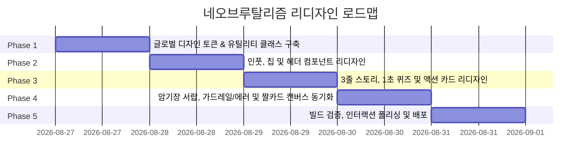

# 🎨 [Mem-Pop] 네오브루탈리즘 (Neo-Brutalism) 톤앤매너 리디자인 계획서

본 문서는 루트 디렉터리의 [`design.md`](../design.md) 디자인 시스템을 기반으로, 기존의 소프트 글래스모피즘 UI를 **강렬하고 위트 있는 네오브루탈리즘(Neo-Brutalism) 비주얼 스타일**로 전면 전환하기 위한 상세 개발 계획서입니다.

---

## 📌 1. 리디자인 목표 및 핵심 방향

| 구분 | 기존 디자인 (v1.3) | 네오브루탈리즘 리디자인 (v2.0) |
| :--- | :--- | :--- |
| **비주얼 무드** | 슬릭한 다크/글래스모피즘, 부드러운 블러 그림자 | **고대비 팝(Pop), 굵은 블랙 테두리, 단단한 하드 섀도우** |
| **배경 및 메인 컬러**| 딥 다크/슬레이트 배경, 인디고 블루 포인트 | **#FFF8EF (크림 아이보리) 베이스 + #FFD600 (비비드 옐로우)** |
| **선과 그림자** | 은은한 1px 보더, 0px 4px 20px 블러 그림자 | **3px 하드 블랙 보더 + 6px~8px 단단한 오프셋 섀도우** |
| **인터랙션 피드백** | 부드러운 스케일 축소 및 투명도 변경 | **클릭 시 섀도우가 0px로 눌리는 물리적 '찰진 팝' 인터랙션** |
| **퀴즈 & 피드백** | 소프트 그린/레드 하이라이트 | **#00C853(비비드 그린), #FF5252(비비드 레드) 볼드 블록 반전** |

---

## 🗓️ 2. 리디자인 스프린트 단계별 실행 계획

---

## 🛠️ 3. 컴포넌트별 상세 수정 계획

### 🔹 Step 1: 글로벌 디자인 토큰 & 유틸리티 정의 ([`app/globals.css`](../app/globals.css))
- 크림 아이보리(`#FFF8EF`), 비비드 옐로우(`#FFD600`), 하드 블랙(`#1A1C1E`) 컬러 변수 정립
- 네오브루탈리즘 전용 유틸리티 클래스 추가:
  - `.neo-box`: `bg-white border-[3px] border-[#1A1C1E] shadow-[5px_5px_0px_#1A1C1E] rounded-2xl`
  - `.neo-btn-primary`: `bg-[#FFD600] border-[3px] border-[#1A1C1E] shadow-[4px_4px_0px_#1A1C1E] active:translate-x-[4px] active:translate-y-[4px] active:shadow-none`
  - `.neo-btn-secondary`: `bg-white border-[2.5px] border-[#1A1C1E] shadow-[3px_3px_0px_#1A1C1E] hover:bg-yellow-50 active:translate-x-[3px] active:translate-y-[3px] active:shadow-none`

### 🔹 Step 2: 헤더 & 키워드 입력 컴포넌트 리디자인 ([`components/keyword-input.tsx`](../components/keyword-input.tsx), [`app/page.tsx`](../app/page.tsx))
- **헤더**: 비비드 옐로우 타이틀 뱃지, 도파민 넘치는 팝 텍스트 스타일링
- **입력창**: 3px 블랙 테두리와 6px 오프셋 섀도우가 적용된 볼드 인풋 박스
- **추천 칩**: 핑크, 민트, 옐로우 파스텔 톤의 팝 칩 버튼 (`hover:translate-y-[-2px]`)
- **생성하기 CTA 버튼**: 시선을 압도하는 비비드 옐로우 + 굵은 글씨 + 쫀득한 누름 피드백

### 🔹 Step 3: 3줄 연상 암기 스토리 카드 ([`components/story-card.tsx`](../components/story-card.tsx))
- **배경 카드**: 화이트 바탕 + 3px 블랙 테두리 + 4px 섀도우
- **3줄 스토리 카드**: 비비드 옐로우 틴트 배경 + 단계별 도파민 뱃지 (민트 `1.상황연결`, 코랄 `2.말장난`, 바이올렛 `3.펀치라인`)
- **툴바**: 듣기, 저장, 짤저장, 복사 버튼을 네오브루탈리즘 마이크로 버튼으로 탈바꿈

### 🔹 Step 4: 3지선다 1초 퀴즈 인터랙션 ([`components/quiz-card.tsx`](../components/quiz-card.tsx))
- 3개 보기를 단단한 블랙 보더 버튼으로 구성
- **정답 선택 시**: `#00C853` 비비드 그린 배경 + 화이트 텍스트 + 🎉 정답 도파민 뱃지
- **오답 선택 시**: 선택 보기는 `#FF5252` 비비드 레드, 정답 보기는 `#00C853` 비비드 그린으로 즉각 반전
- 1초 명쾌한 해설 박스에 팝 옐로우 하이라이트 적용

### 🔹 Step 5: 나만의 암기장 서랍, 가드레일 카드 & SNS 짤 이미지 캔버스 동기화
- [`components/saved-cards-drawer.tsx`](../components/saved-cards-drawer.tsx): 팝 크림 배경과 블랙 보더의 레트로 서랍 UI
- [`components/guardrail-card.tsx`](../components/guardrail-card.tsx), [`components/error-card.tsx`](../components/error-card.tsx): 옐로우/레드 경고 네오 박스
- [`lib/image-export.ts`](../lib/image-export.ts): 짤 카드 이미지 캔버스도 네오브루탈리즘 옐로우&블랙 프레임으로 렌더링 동기화

---

## 🎯 4. 품질 및 완료 기준 (Definition of Done)

1. **디자인 일관성**: 모든 인터랙티브 요소(버튼, 인풋, 카드, 모달)에 3px 블랙 테두리와 하드 섀도우가 빈틈없이 적용될 것.
2. **물리적 손맛 (Tactile Feedback)**: 버튼 클릭 시 오프셋 깊이만큼 이동하며 눌리는 네오브루탈리즘 인터랙션 완성.
3. **가독성 & 접근성**: 크림 아이보리와 하드 블랙의 높은 명도 대비(Contrast Ratio 12:1 이상)로 시인성 확보.
4. **빌드 무결성**: Next.js 프로덕션 빌드 에러 없이 100% 통과 및 Vercel 배포 준비 완료.
